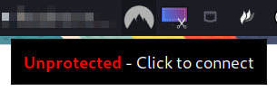
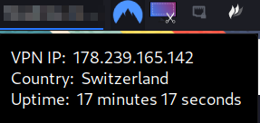
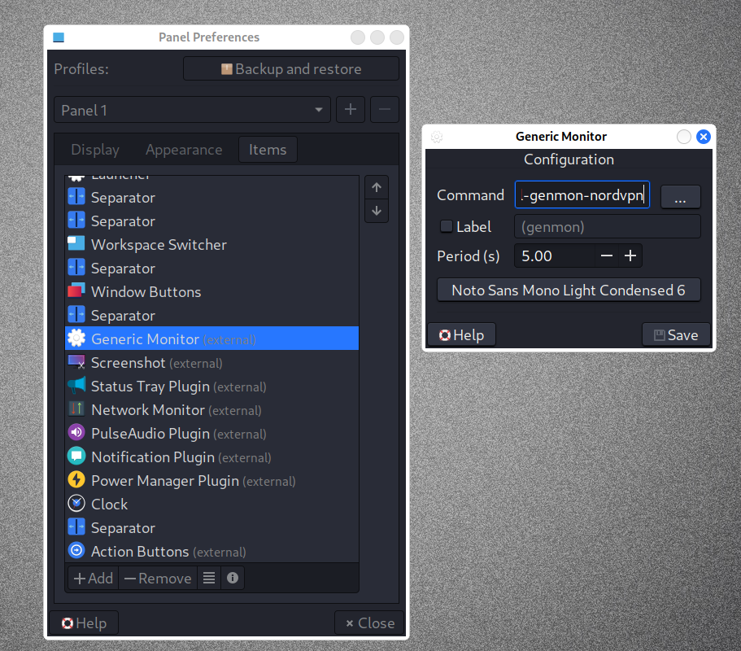

# NordVPN Panel Plugin for XFCE / Kali #

The Kali built-in VPN notifier is doing a great job for standard TAP/TUN based VPNs. Unfortunately Nord VPN is using their proprietary NordLynx protocol.

This XFCE is based on the XFCE GenMon plugin and displays the NordVPN connection status.

## Installation ##

Create a Generetic Monitor panel item and point the command to the `xfce4-panel-genmon-nordvpn.sh` script. Make sure that `Label`is unchecked.  

https://docs.xfce.org/panel-plugins/xfce4-genmon-plugin/start